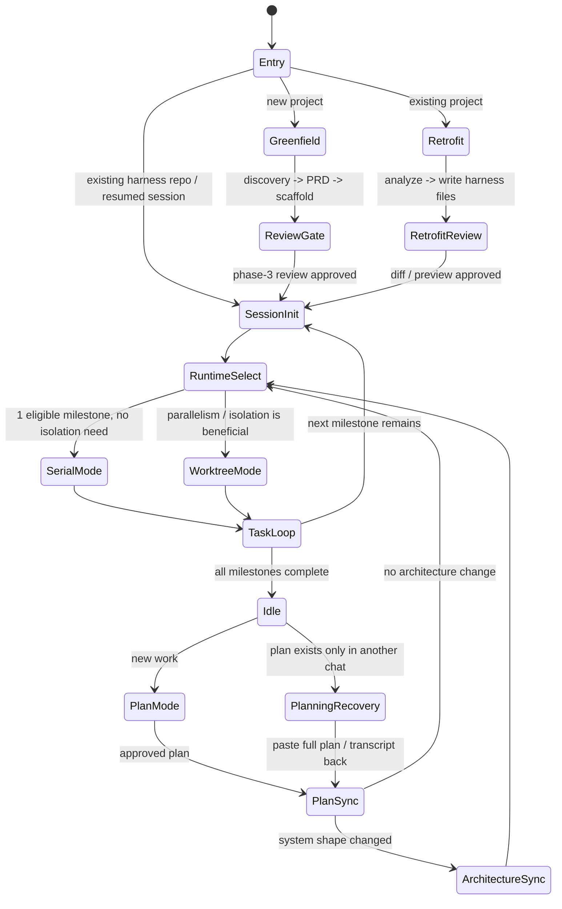

# Harness Engineer CLI

An agent-first project framework based on Harness Engineering principles.
Works with **Claude Code** and **Codex** on **Windows**, macOS, and Linux.
Skill version: `2026.03.10`

## What it does

Two modes:

- **Greenfield** — New project from scratch. Product discovery → PRD → scaffold → execution.
- **Retrofit** — Existing project. Analyze the codebase, add harness layer on top.

Both modes generate a CLI that agents use to autonomously loop through tasks:
pick → start → code → validate → commit → done → repeat.

- **Node/TS projects** — TypeScript CLI (`scripts/harness.ts` + `scripts/harness/` modules), with full capability: optional managed worktrees, `plan:apply`, and agent lifecycle
- **Strict non-Node projects** (Python/Go/Rust, user explicitly refuses Node) — Shell CLI (`scripts/harness.sh` + `Makefile`), single-agent only: `init` / `status` / `validate` / `next` / `start` / `done` / `block`

> **`references/replay-protocol.md` is for framework-level development only.**
> It documents the SOP for verifying changes to this skill's own reference files across
> downstream fixture repos. It is NOT part of any project's task loop or completion criteria.
> Per-project completion is defined by the Idle Protocol in `references/skill-execution.md`:
> all milestones merged → changelog reviewed → human confirms release tag.

## Top-Level State Machine

The framework has different entry paths, but they all converge into the same runtime loop.
Core rule: chat is input; repo files are state. Execution only proceeds from repo-backed state
such as `docs/PLAN.md`, `docs/progress.json`, and `ARCHITECTURE.md`.



- `PlanSync` is mandatory before execution resumes. Do not continue from a chat-only summary.
- `ArchitectureSync` is required when module boundaries, integrations, deployment topology, or core data flow change.
- `WorktreeMode` is conditional, not the default.
- `PlanningRecovery` is the fallback path when planning happened elsewhere and the repo was not synced yet.

## How to install

Add this folder as a skill in claude.ai. The skill triggers when you say things like
"new project", "bootstrap", "scaffold", "add harness to my project", or "retrofit".

## Execution Modes

The generated project supports two execution modes. You choose which one during setup,
and can switch anytime by editing the config files.

### Auto Mode (default)

The agent runs the full task loop without asking permission. It only pauses at
Human quality checkpoints (security changes, merge failures, blocked tasks).

This is the default because the harness CLI + git hooks + CI already enforce all
rules mechanically. The agent can't commit bad code — the hooks reject it.

Config templates for Claude Code and Codex live in `references/project-configs.md`.
Use the `Claude Code — .claude/settings.json` and `Codex — .codex/config.toml` sections
there as the canonical source.

### Menu Mode (supervised)

The agent pauses before every shell command and asks for your approval.
Use this when you want to review each step, or when working on sensitive code.

**To switch Claude Code to Menu Mode:**

Edit `.claude/settings.json` — remove the harness commands from `allowedTools`.

Now the agent will ask "Allow Bash(npx tsx scripts/harness.ts validate)?" before
each command. You press Y to approve or N to skip.

**To switch Codex to Menu Mode:**

Edit `.codex/config.toml` and set `approval_policy = "on-request"`.

Now Codex pauses for every command and waits for your approval.

### Switching between modes

| Want | Claude Code | Codex |
|------|------------|-------|
| **Auto → Menu** | Remove `Bash(...)` entries from `allowedTools` | Change `approval_policy` to `"on-request"` |
| **Menu → Auto** | Add `Bash(...)` entries back to `allowedTools` | Change `approval_policy` to `"never"` |

Changes take effect on the next agent session. No restart needed — just start a new session.

### When to use which

| Situation | Recommended mode |
|-----------|-----------------|
| Routine feature work | Auto |
| First time using the harness | Menu (to see what the agent does) |
| Security-sensitive code | Menu |
| Unfamiliar codebase (retrofit) | Menu for first milestone, then Auto |
| Parallel agents on multiple milestones | Auto |
| Debugging a blocked task | Menu |

## File structure

```
harness-engineer-cli/
├── SKILL.md                        ← Main skill file (claude.ai reads this)
├── README.md                       ← You are here
├── scripts/                        ← Maintenance scripts (version bump, local tooling)
└── references/                     ← Templates used during generation
    ├── skill-greenfield.md         ← Greenfield workflow (discovery → PRD → scaffold)
    ├── skill-retrofit.md           ← Existing-project retrofit workflow
    ├── skill-desktop.md            ← Desktop-specific reference (Electron/Tauri)
    ├── skill-mobile.md             ← Mobile-specific reference (Expo/EAS)
    ├── skill-auth.md               ← Auth-specific reference
    ├── skill-artifacts.md          ← Generated docs / config artifact templates
    ├── skill-execution.md          ← Post-scaffold runtime + task-loop handoff
    ├── harness-cli.md              ← The CLI source code + schema + hooks (TypeScript)
    ├── scaffold-templates.md       ← CLI scaffold command templates (MCP, SKILL.md, Cloudflare, agent)
    ├── harness-native.md           ← Shell-based CLI alternative for non-Node projects
    ├── eslint-configs.md           ← ESLint flat configs per framework
    ├── project-configs.md          ← TS, Python, Go, Rust, workspace, Docker, CI configs
    ├── gitignore-templates.md      ← .gitignore templates per stack
    ├── execution-runtime.md        ← Agent guidelines (context budget, parallel, quality gates)
    ├── execution-advanced.md       ← Optional release automation, docs site, memory system
    └── replay-protocol.md          ← Downstream replay / fixture verification SOP
```

## What gets generated into your project

```
your-project/
├── AGENTS.md + CLAUDE.md           ← Agent instructions (identical content; fixed Interaction Rules + Iron Rules)
├── ARCHITECTURE.md                 ← Domain map, dependency layers
├── docs/
│   ├── PRD.md                      ← Product requirements
│   ├── PLAN.md                     ← Milestones + tasks
│   ├── progress.json               ← Machine-readable state (CLI manages this)
│   ├── learnings.md                ← Agent learnings log
│   └── ...
├── scripts/
│   ├── harness.ts                  ← [Node/TS] CLI entry point — thin command router
│   ├── check-commit-msg.ts         ← [Node/TS] Commit message format enforcer
│   ├── harness/                    ← [Node/TS] CLI modules (config, tasks, quality…)
│   └── harness.sh                  ← [Non-Node] Shell-based CLI alternative
├── Makefile                        ← [Non-Node] validate / done / next / block targets
├── schemas/
│   └── progress.schema.json        ← Validates progress.json
├── .claude/settings.json           ← Claude Code config (auto mode)
├── .codex/config.toml              ← Codex config (auto mode)
├── .husky/                         ← [Node/TS] Git hooks (pre-commit, commit-msg, pre-push)
├── .pre-commit-config.yaml         ← [Python/Go] Hook alternative to husky
├── .githooks/                      ← [Rust] Hook alternative to husky
└── ...                             ← Scaffold (src/, tests/, configs, CI, Docker)
```

## CLI commands

```
# Worktree management (optional milestone isolation / parallel execution — run from main repo root)
harness worktree:start <M-id>   Create branch + worktree + install + init + auto-start
harness worktree:finish <M-id>  Serialized root-side rebase → merge → archive plans → push → cleanup
harness worktree:rebase         Rebase current worktree onto latest main
harness worktree:status         Show worktrees, agents, auto-finish jobs, and merge readiness
harness migrate                 Refresh harness-managed runtime folders + schema after upgrades

# Session (run from main/root or inside the milestone worktree)
harness init Session boot: sync plans, stale check, memory reminders, print status
harness status            Print current milestone, task, blockers, progress

# Task loop (serial on main/root when exactly one milestone is eligible; otherwise inside a worktree)
harness next              Find and print the next unblocked task
harness start <id>        Claim a task → auto-updates progress.json + PLAN.md
harness validate          lint:fix → lint → type-check → test
harness validate:full     + integration/e2e when matching test files exist + file-guard
harness done <id>         Complete a task → auto-updates state + commit hash + verifies worktree cleanliness before cascading
harness block <id> <msg>  Mark task blocked, log reason
harness reset <id>        Revert task to ⬜ (undo start or unblock)
harness learn <cat> <msg> Log a reusable learning entry

# Quality gates
harness merge-gate        Full gate check before worktree:finish
harness stale-check       Detect stale docs, env, plans
harness file-guard        Check no source file exceeds 500 lines
harness schema            Validate progress.json against JSON Schema
harness changelog         Generate release notes from commit messages

# Planning (add new work mid-project)
harness plan:apply [file] Parse plan → analyze state → insert milestones + task mirrors + deps

# Ops / rarely needed manually (auto-called or recovery only)
harness recover           Close milestones already merged (auto at init; manual for recovery)
harness worktree:reclaim <M-id> Reclaim a stale milestone and reopen its worktree
harness plan:status       Show project progress overview for planning context

# Scaffold (inject capability templates — no web search needed)
harness scaffold mcp            MCP server: src/tools/, server.ts, tests
harness scaffold skill           SKILL.md agent discovery file
harness scaffold llms-txt        llms.txt for LLM discoverability
harness scaffold milestone:agent Pre-built 11-task milestone for agent work
harness scaffold agent-card      A2A Agent Card (/.well-known/agent.json)
harness scaffold agent-observe   Tool observability: metrics, latency, errors
harness scaffold agent-auth      Auth + rate limit for remote SSE
harness scaffold agent-pay       x402 micropayments + Stripe metered billing
harness scaffold agent-test      MCP protocol compliance tests
harness scaffold agent-schema-ci CI: detect SKILL.md vs code schema drift
harness scaffold agent-version   Tool versioning strategy docs
harness scaffold agent-client    Multi-agent client: discover + call remotes
harness scaffold agent-prompts   MCP Prompts: pre-built prompt templates
harness scaffold agent-webhook   Long-running task + webhook callback
harness scaffold agent-cost      Per-call cost estimation + audit log
harness scaffold cloudflare      wrangler.toml + .dev.vars + CI
```

Execution start rule:
- Default serial path: run `harness init` from main/root when there is one eligible milestone, one active agent, and no explicit isolation need.
- Managed worktree path: run `harness worktree:start <M-id>` only when 2+ milestones can run in parallel or milestone isolation is beneficial.
- Retrofit / plan-mode handoff: sync the plan into `docs/PLAN.md` and `docs/progress.json` before leaving planning; `init` auto-`plan:apply` is recovery, not the primary ingest path.
- Architecture sync in planning: if the approved plan changes module boundaries, integrations, deployment topology, or core data flow, update `ARCHITECTURE.md` before leaving planning and sync `docs/gitbook/architecture.md` when present.
- Planning fallback: if planning already happened in another chat or the session exited before sync, paste the full approved plan output or transcript back into the current session, reconstruct `docs/exec-plans/active/*.md`, then immediately sync `docs/PLAN.md` + `docs/progress.json` and any architecture doc changes.

## Requirements

**Node/TS projects (TypeScript CLI):**
- Node.js 18+
- Git
- One of: pnpm, bun, or npm. For Expo / EAS projects, `yarn` is also supported and is often preferable for monorepos.
- `tsx` (added automatically as a dev dependency)

**Strict non-Node projects (Shell CLI fallback — Python, Go, Rust):**
- Git
- `jq` (JSON processor — for `scripts/harness.sh`)
- `bash` 4+ (macOS ships bash 3; install bash via Homebrew if needed)
- Language runtime: Python 3.11+ / Go 1.22+ / Rust stable
- No Node.js or npm required — the shell CLI handles the single-agent task loop only
- Windows note: prefer the TypeScript CLI on native Windows. The shell CLI requires Git Bash or WSL because it uses POSIX shell utilities.

## Upgrade And Rollback

- `harness migrate` only backfills harness-managed runtime folders, schema files, and missing runtime fields. It does not rewrite `AGENTS.md`, `CLAUDE.md`, or workflow prose.
- If a merged milestone must be undone, use `git revert` on the merge commit, then manually reconcile `docs/PLAN.md`, `docs/progress.json`, and any archived exec-plan files. The harness does not provide a `revert-merge` command yet.

## Version Update Shortcut

From repo root:

```bash
pwsh scripts/bump-version.ps1            # set version to today's date (YYYY.MM.DD)
pwsh scripts/bump-version.ps1 -Version 2026.03.11  # explicit version
```

This updates:

- `VERSION`
- `SKILL.md` (frontmatter `version`)
- `README.md` (`Skill version`)

## Self-Iteration + Self-Correction

When you detect a workflow/process drift (commands changed, duplicated docs, wrong
template source, etc.):

```bash
pwsh scripts/skill-maintenance.ps1                  # full health check only
pwsh scripts/skill-maintenance.ps1 -AutoFix         # run safe self-corrections
pwsh scripts/skill-maintenance.ps1 -AutoFix -Version 2026.03.12  # optional explicit version sync
```

Every run of `bump-version.ps1` and every `-AutoFix` run appends an entry to
`SKILL-AUDIT.md` — review it to trace what changed and why.

Recommended loop:

1. Run maintenance check.
2. Fix any failures manually.
3. Re-run with `-AutoFix` to sync obvious drift.
4. Re-run check to verify the process contract is closed again.

## Validation Strategy

This repo is a doc-first skill bundle, so template changes should be verified by replaying them
into representative fixture outputs or downstream repos before being treated as done.

Recommended minimum replay matrix:

- Web app, single-package TypeScript scaffold
- Desktop app scaffold (`Electron` or `Tauri`)
- Mixed-language monorepo (`apps/web` in TS + backend in Python, Go, or Rust)

Snapshot or diff at least these generated artifacts:

- `docs/PLAN.md`
- `docs/progress.json`
- `schemas/progress.schema.json`
- `scripts/harness.ts` and `scripts/harness/`
- Stack-native manifests such as `package.json`, `pyproject.toml`, `go.work`, and `Cargo.toml`

If the change touches harness runtime behavior, CI, or generated workflow rules, replay it in at
least one real downstream project or fixture repo and confirm the generated project still passes
`harness validate`.
