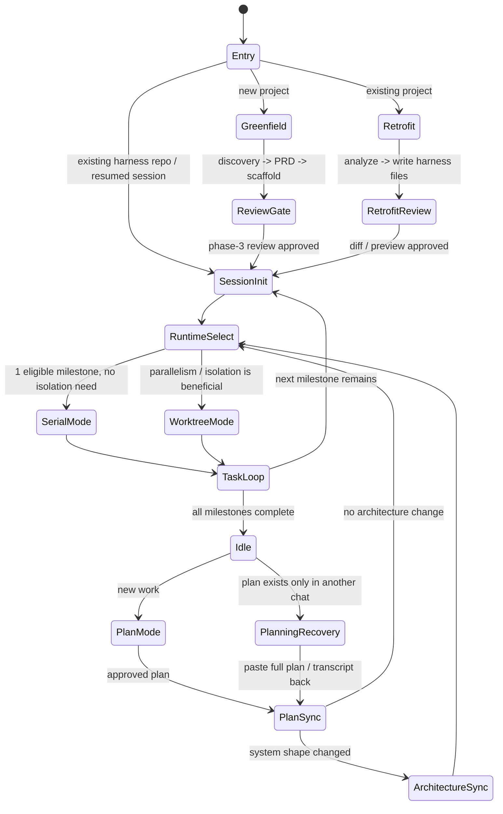

# Harness Engineer

This skill creates a complete, agent-first project foundation based on Harness Engineering
principles. It works in TWO modes:

- **Greenfield** — New project from scratch. Full product discovery, PRD, scaffold, everything.
- **Retrofit** — Existing project. Analyze the codebase, add harness layer on top. No scaffold
  generation, no long-task bootstrap. Future work flows through plan mode.

The philosophy: AGENTS.md is a **table of contents, not an encyclopedia**. Keep it concise,
pointing to deeper sources of truth. All project knowledge lives in the repo as versioned,
discoverable artifacts — because if an agent can't see it, it doesn't exist.
Generated `AGENTS.md` / `CLAUDE.md` always include fixed `Interaction Rules` and fixed
`Iron Rules`; project-specific sections fill in the rest.

For humans maintaining this skill repo itself, start at `docs/index.md`.

---

## Discovery Gate

Treat the initial questioning flow as a **blocking gate**, not a courtesy. When this skill
triggers, override any default "start implementing immediately" bias until the mode-specific
intake is complete.

- **Greenfield:** Do NOT create files, scaffolds, commands, plans, or architecture docs before
  completing Phase 1 in `docs/agent/skill-greenfield.md`. If the user already gave some of the
  answers, restate them briefly and ask only for the missing pieces.
- **Retrofit:** Do NOT write the harness layer until Retrofit Step 1 has inspected the repo and
  collected the missing context needed to describe the existing system accurately.
- **No structured prompt tool:** If `ask_user_input` is unavailable, ask the prose equivalent in
  short batches. Do NOT silently skip the questions just because the runtime is a plain terminal.
- **Conversation shape:** Ask 1 structured prompt or 1-3 prose questions at a time, wait for the
  answer, then continue. For Web / Mobile / Desktop projects, ask UI decisions one by one after
  the frontend direction is set so the user can react to each visual choice separately. Do NOT
  collapse the rest of discovery into one giant questionnaire unless the user explicitly asks for
  that format.
- **Structured prompt style:** When using `ask_user_input`, lead with one short PM-style sentence
  in prose, then ask only 2-3 curated options per question. Treat longer option inventories as
  internal candidate pools to narrow from, not as menus to dump onto the user.
- **Greenfield cadence:** For new projects, start with the project name and short introduction,
  do an early research pass, ask the PM-style follow-up questions, do a second targeted research
  pass, summarize your recommendations, and only then move into stack-choice prompts.
- **Milestone-aware dependency policy:** Phase 3 scaffold generation writes the repo shape,
  manifests, docs, and starter code, but it does NOT automatically bootstrap the full dependency
  graph. Do NOT run package-manager install/sync/build commands by default, and do NOT front-load
  milestone-specific packages into the initial scaffold just because they may be needed later.
  Only include the minimal dependency set required for the generated scaffold and harness runtime
  to exist. Add feature/integration packages when the milestone that needs them actually starts,
  unless the user explicitly asks for a fully bootstrapped repo immediately.
- **Foundation-only scaffold policy:** Phase 3 lays the project foundation only. Do NOT treat
  scaffold output as completion of product milestones. Placeholder pages, route shells, provider
  stubs, schemas, docs, configs, and empty integrations are setup work, not delivered features.
  Seed milestones so their task rows still represent real implementation/integration outcomes, and
  keep them `Not Started` until execution satisfies the `Done When` criteria.
- **Discuss first, sync on go-ahead:** It is normal to discuss a change in chat first. But once
  the user says "OK, do it", "update this", "follow this plan", or the conversation already
  contains a sufficiently detailed change plan, stop treating it as chat-only context. Mirror the
  work into repo state immediately. If it belongs to the active milestone, add or refine the task
  there; if it does not, create a small follow-up task or micro-milestone and sync
  `docs/PLAN.md` + `docs/progress.json` before active execution starts. Do NOT let actionable
  planning content live only in chat.
- **Frontend-first sequencing:** For Web / Mobile / Desktop projects, ask about the frontend
  direction first, then ask the UI brief one decision at a time, and only after that move into backend / API /
  database / deploy detail. Do NOT dump the whole architecture questionnaire in one turn.
- **Framework neutrality:** Do NOT silently default web projects to `Next.js`. Treat it as one
  option among several valid web stacks, and only choose it when the user explicitly asks for it
  or the discovered constraints make it the best fit.
- **Before generation:** Summarize the captured brief and remaining assumptions before moving into
  PRD or scaffold generation. If a critical assumption is still open, ask instead of guessing.

Mode selection only chooses the intake path. It does **not** authorize scaffold generation by
itself.

---

## Top-Level State Machine

Use this as the mental model before reading any deeper reference file. Different entry paths
exist, but all real work converges into the same repo-backed execution loop.

Core rule: chat is input; repo files are state. Do not resume execution from chat memory alone.

- `PlanSync` is mandatory before execution resumes.
- `PlanningRecovery` is the fallback path when planning happened elsewhere and the repo was not synced.
- `ArchitectureSync` happens whenever the approved plan changes module boundaries, integrations,
  deployment topology, or core data flow.
- `WorktreeMode` is conditional; default execution is serial-first.

## Cross-Agent Continuation

Any repo generated or retrofitted by this skill must be resumable by either Claude Code or Codex
from repo state alone.

- The handoff surface is repo-tracked state: `AGENTS.md` / `CLAUDE.md`, `ARCHITECTURE.md`,
  `docs/PLAN.md`, `docs/progress.json`, `docs/exec-plans/active/`, and, when present,
  `docs/product/frontend-design.md`, `docs/product/design.md`, `docs/product/design-preview.html`, and `docs/gitbook/*`.
- Agent-specific config (`.claude/settings.json`, `.codex/config.toml`) only adapts permissions,
  plan routing, and sandbox behavior. It must never become the only place a workflow decision lives.
- If planning, architecture, UI direction, or public docs changed in one agent, sync the repo files
  before handing work to the other agent.
- External skill paths or claude.ai-only context may help generation, but once a repo file exists,
  the repo copy is authoritative for the next agent session.

## Closed-Loop Rule

Every meaningful workflow in this skill must close the loop before it is considered complete.

- Discovery closes only when the captured brief is reflected in scaffold inputs and the next phase
  can continue from repo-backed artifacts instead of chat memory.
- Planning closes only when the plan file is written, `docs/PLAN.md` + `docs/progress.json` are
  synced, and the next execution entrypoint is clear.
- Execution closes only when code/docs changes are validated, task state is updated, and the repo
  is handoff-ready for either Claude Code or Codex.
- Docs work closes only when the affected repo docs are updated from current sources of truth, not
  just discussed or partially drafted.
- Handoffs close only when the incoming agent can resume from repo state alone with no missing chat context.

---

## How This Skill Is Structured (Read This First)

This skill is split into focused reference files to avoid loading everything upfront.
**Read only the file(s) relevant to the current task. Do NOT pre-load all files.**

| File | When to read |
|------|-------------|
| `docs/agent/skill-retrofit.md` | User wants to add harness to an existing project |
| `docs/agent/skill-greenfield.md` | User wants a new project (Phases 1–3: discovery, PRD, scaffold) |
| `docs/agent/skill-artifacts.md` | During generation — all artifact templates (AGENTS.md, ARCHITECTURE.md, PLAN.md, configs) |
| `docs/agent/skill-execution.md` | After scaffold — execution runtime, task loop, git workflow, doc site (Phases 4–6) |
| `docs/agent/skill-desktop.md` | Project type is Desktop (Electron/Tauri) — shell split, IPC/commands, updater, packaging, testing |
| `docs/agent/skill-mobile.md` | Project type is Mobile (Expo/React Native) — architecture, EAS build, iOS/Android deploy |
| `docs/agent/skill-auth.md` | Project includes authentication — Better Auth setup, env vars, OAuth, mobile auth |
| `docs/agent/harness-native.md` | Project is non-JS/TS AND user does not want Node.js — shell-based CLI, Makefile integration, pre-commit hooks |
| `docs/agent/project-configs.md` | During Phase 3 scaffold generation — tsconfig, pyproject.toml, go.mod, Cargo.toml, CI workflows, Docker |
| `docs/agent/harness-cli.md` | During Phase 3 scaffold generation — CLI source code, schema, git hooks (TypeScript version) |
| `docs/agent/scaffold-templates.md` | During Phase 3 if project needs scaffold commands — MCP, SKILL.md, Cloudflare, agent capability templates |
| `docs/agent/eslint-configs.md` | During Phase 3 for JS/TS projects — ESLint flat config templates |
| `docs/agent/gitignore-templates.md` | During Phase 3 — .gitignore templates per stack |
| `docs/agent/execution-runtime.md` | During Phase 3 — agent guidelines: context budget, parallel coordination, quality gates |
| `docs/agent/execution-advanced.md` | Only when needed — release automation, docs site, memory system |
| `docs/agent/replay-protocol.md` | **Skill maintenance only** — when harness CLI behavior, CI/hook templates, schema contracts, or scaffold outputs change in a way that affects downstream consumer repos. Run a cross-repo replay before calling the change complete. |

**Load order:**
- Retrofit path: `skill-retrofit.md` → then `skill-artifacts.md` when generating files
- Greenfield path: `skill-greenfield.md` → then `skill-artifacts.md` → Phase 3 exit gate in
  `skill-greenfield.md` → then `skill-execution.md`
- Mobile projects: also read `skill-mobile.md` before generating scaffold
- Desktop projects: also read `skill-desktop.md` before generating scaffold. Use targeted web
  search only for version-sensitive packaging, signing, notarization, updater, or plugin details
  that are not already covered by the desktop reference.
- Non-JS/TS projects without Node.js: also read `harness-native.md` before generating the
  harness layer. This provides the shell-based CLI, Makefile integration, and pre-commit hooks
  that replace the TypeScript CLI and husky.
- Agent Tool / MCP Server projects: `skill-greenfield.md` → `skill-artifacts.md` (includes
  SKILL.md template for agent discovery) → `skill-execution.md`. The generated project will
  include a `SKILL.md` at the root that describes tools, connection methods, and env vars
  so other AI agents can discover and use the MCP server.
- Any project with auth: also read `skill-auth.md` before generating auth code
- Mixed-language monorepos: keep `skill-greenfield.md` as the primary workflow, then use
  `project-configs.md` for Python / Go / Rust manifests. Do not force JS-only workspace rules onto
  non-JS apps.
- Frontend projects: `docs/product/frontend-design.md` must be bundled into every project that has
  a frontend so Claude Code and Codex (which cannot access claude.ai skill paths) can read it.
  Generation strategy — try in order until one succeeds:
  1. If the `frontend-design` skill is already active in this claude.ai session, read its
     content as a base template, then customize it using Phase 1 call 5 answers before
     writing to `docs/product/frontend-design.md`.
  2. If a local copy exists on the machine (common paths: `~/.agents/skills/frontend-design/SKILL.md`,
     `C:\Users\<user>\.agents\skills\frontend-design\SKILL.md`, `/mnt/skills/public/frontend-design/SKILL.md`),
     read it as a base template and apply the same call 5 customizations.
  3. If neither source is reachable, generate `docs/product/frontend-design.md` directly from
     the call 5 answers — do not use a generic minimal fallback.

  In ALL cases, the call 5 answers MUST be reflected:
  - Q11 (component library) → "Component System" section: library name, install command,
    import conventions, and Tailwind config notes (if applicable)
  - Q12 (design aesthetic) → "Visual Language" section: color tone, spacing density,
    border-radius scale, font personality, shadow depth
  - Q13 (layout pattern) → "Layout Patterns" section: primary nav structure, page
    skeleton template, responsive breakpoint strategy
  - Q14 (visual references / brand anchors) → "Reference Anchors" section: existing
    brand/UI to preserve, cited inspirations, and explicit "avoid" cues
  - Q15 (content density) + Q16 (theme preference) → "Preview Rendering Rules"
    section: density target, light/dark expectation, CTA hierarchy, and preview emphasis
  Log which strategy was used as a note in `docs/learnings.md`.
  For every frontend project, keep the UI artifact chain consistent:
  `docs/product/frontend-design.md` → `docs/product/design.md` → `docs/product/design-preview.html`.
  `docs/product/frontend-design.md` defines the global design system and style direction.
  `docs/product/design.md` translates that into the product-specific wireframe: overall app shell,
  navigation, global layout regions, and per-page/screen contracts.
  The HTML preview is a **mid-fi styled static preview**, not a pure wireframe and
  not production code.
- GitBook / project-intro companion docs: for ALL new projects, generate `docs/gitbook/`
  as part of Phase 3 scaffold — this is not conditional on user request. Treat it as a
  required parallel deliverable alongside AGENTS.md and PLAN.md. Generate and maintain a `docs/gitbook/` markdown set by default
  (or the repo's existing docs root if one already exists). Minimum scope: landing page,
  product overview, problem/users, architecture/capabilities, quickstart, roadmap, and
  `SUMMARY.md`. Preferred starter shape:
  `docs/gitbook/README.md`, `docs/gitbook/product-overview.md`,
  `docs/gitbook/target-users.md`, `docs/gitbook/architecture.md`,
  `docs/gitbook/quickstart.md`, `docs/gitbook/roadmap.md`, and
  `docs/gitbook/SUMMARY.md`. Keep these pages derived from `docs/PRD.md`,
  `ARCHITECTURE.md`, `docs/PLAN.md`, and the current codebase state.
  When generating or revising `docs/PLAN.md`, add explicit GitBook tasks whenever a milestone
  changes product positioning, onboarding, architecture, integrations, or roadmap. For a new
  project, add an early baseline task to create the GitBook structure. For a retrofit, add a
  catch-up docs task or milestone if no coherent project-introduction docs exist yet.

---

## Mode Selection

First, determine which mode to use. If the user uploads files or mentions an existing
project, use Retrofit. If they describe something new, use Greenfield.

If unclear, ask with `ask_user_input` when structured prompt tools are available.
If your runtime does not provide `ask_user_input` (for example Codex in a plain terminal flow),
ask the same choice in prose and continue from the user's answer:

**ask_user_input / prose equivalent:**
1. **Mode** (single_select): What's the starting point?
   - Options: `New project from scratch`, `Add harness to an existing project`

If **New project from scratch** → read `docs/agent/skill-greenfield.md` and follow it
If **Add harness to existing project** → read `docs/agent/skill-retrofit.md` and follow it

